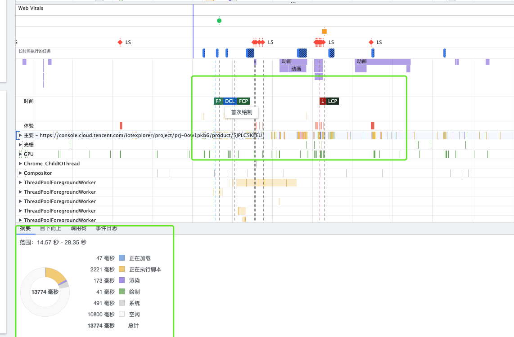

# 性能优化

[toc]

[浏览器工作原理](https://developer.mozilla.org/zh-CN/docs/Web/Performance/How_browsers_work)
[performance性能指标解读](https://segmentfault.com/a/1190000020509556)

## 性能指标

1. 正在加载 => 网络请求、文件下载
2. 只在执行脚本 => script解析
3. 渲染 => render
4. 绘制 => paint

### 性能参考值

### google web性能指标

[google web性能指标](https://juejin.cn/post/7026907443250593805)
(核心指标：lcp 最大内容绘制、fid首次输入延迟、cls累积布局偏移)

#### lcp （largest content paint）

 **定义**

 最大内容绘制 (LCP) 指标会根据页面首次开始加载的时间点来报告可视区域内可见的最大图像或文本块完成渲染的相对时间。
 报告给最大内容绘制的元素大小通常是用户在可视区域内可见的大小。如果有元素延伸到可视区域之外，或者任何元素被剪裁或包含不可见的溢出，则这些部分不计入元素大小。 

   **怎么测量**
   1. google开源sdk web vitals
   2. js计算（目前这个api只有chromiun内核的支持）利用[事件计时api](https://w3c.github.io/event-timing/)
   3. [利用MutationObserver](https://www.infoq.cn/article/rwGQvlVXXuWh9zNUEsDN)

   **怎么改进**  （又回到性能优化的各种手段）

- 服务器响应改进（缓存）
- js、css渲染阻塞
- 资源加载时间
- 客户端渲染

#### fid (first input delay)

- [减少 JavaScript 执行时间](https://web.dev/bootup-time/)
=> 如何减少又回到按需引入什么的标准优化手段那一套
- [最小化主线程工作](https://web.dev/mainthread-work-breakdown/) => 这里讲得不错，还要补充看下主线程具体做些什么工作
  - [消除输入处理程序的抖动](https://developers.google.com/web/fundamentals/performance/rendering/debounce-your-input-handlers)
      1. 避免在输入（比如scroll、touch）事件中绑定运行时间过长的处理函数。
      2. 不要在输入处理程序中进行样式更改 （style write + style read = force sysnc layout）,布局样式读写不分离马上强制触发重排 => 对样式修改去抖动，控制仅在下一次[requestAnimationFrame](https://developer.mozilla.org/zh-CN/docs/Web/API/Window/requestAnimationFrame)中发生

  - 有复杂的js运算的话考虑利用web worker单独起一个线程并行操作，主线程利用posemessage和其通信，web worker中不能操作dom以及读取window属性
  - [避免大型、复杂的布局和布局抖动](https://developers.google.com/web/fundamentals/performance/rendering/avoid-large-complex-layouts-and-layout-thrashing)  => 这里主要就是减少引发重排的操作，另外变更css的时候需要注意做完所有读操作再做写操作，因为读+写同时出现马上触发强制重排
- 保持较低的请求数和较小的传输大小

1. google 的开发者平台的介绍
google开发者工具文档对运行时性能的介绍
<https://developer.chrome.com/docs/devtools/evaluate-performance/?utm_source=devtools>

<https://web.dev/learn/>

 页面性能可以用google的性能面板做录制去分析
