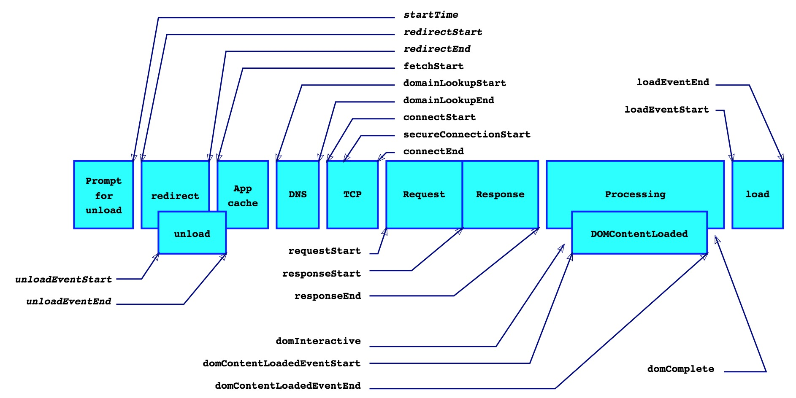

# 性能监控方案

## Web性能计时

[w3c文档](https://w3c.github.io/perf-timing-primer/)
下面是w3c文档的性能图片

大致可以分为几个过程

(页面卸载、重定向 => 查看页面缓存) => 页面请求 => 请求响应 => 页面渲染

## 性能指标确定

### 网络资源获取

#### DNS寻址

采集方式：
兼容情况：

#### TCP建立请求

#### Request时间

#### TTFB首字节传输

#### DOMReady

#### FP

#### FCP

#### LCP

#### FPS

####

#### LOAD