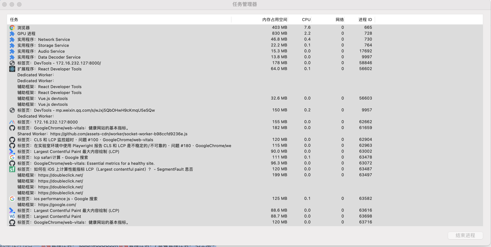

# 浏览器机制

[web.dev文档解释](https://web.dev/howbrowserswork/)
[一文看懂chrome运行机制](https://zhuanlan.zhihu.com/p/102149546)
(包含了html解析demo等的说明)

性能优化不单指优化一个页面的打开速度，在开发环境将一个项目的启动时间缩短使开发体验更好也属于性能优化，大文件上传时为其添加分片上传、断点续传也属于性能优化。在项目开发以及用户使用的过程中，能够让任何一个链路快一点，都可以被叫做性能优化。

## 基础概念一 进程与线程

- 浏览器的多进程架构
1. Browser 进程：浏览器的主进程。主要负责界面显示、用户交互、子进程管理，同时提供存储等功能。
2. 网络进程
- 网络的资源管理、下载等。
3. Renderer 进程：核心任务是将HTML、CSS 和 JavaScript 转换为用户可以与之交互的页面，排版引擎Blink和Javascript引擎V8都是运行在该进程中，默认情况下，Chrome会为每个Tab标签创建一个渲染进程。出于安全考虑，渲染进程都是运行在沙箱模式下
4. GPU 进程：GPU 的使用初衷是为了实现 3D CSS 的效果，只是随后网页、Chrome 的 UI 界面都选择采用 GPU 来绘制，这使得 GPU 成为浏览器普遍的需求。
5. 第三方插件进程：每种类型的插件对应一个进程，仅当使用该插件时才创建。

### 区别

 - 进程是资源分配的最小单位
 - 线程是资源调度的最小单位
 - 进程之间可以通信，不过代价比较大
 - 单线程与多线程，都是相对于进程来讲

### 浏览器中的进程

browser process